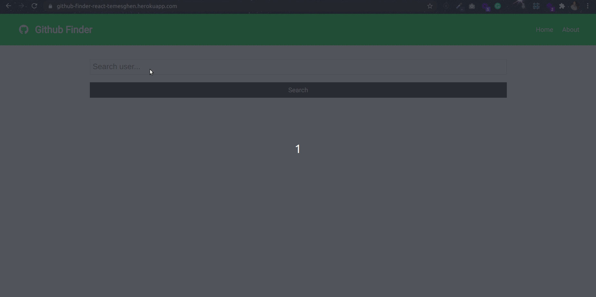

# GitHub Finder

GitHub Finder is a SPA developed using React. It has two version: version one developed using class components whereas the second version developed using Hooks and the Context API. Each version allows end users to search a particular GitHub user. In addition to that it allows someone see the latest repos, followers, followings and other profile info of a GitHub user.

## 🔴 Screenshot

## 🔴 Live Demo

**Click [here](https://github-finder-react-temesghen.herokuapp.com/) in order to see a Live Demo of this project.**

## Project Specification

  - [ ] Use create-react-app to initialize a new React app
  - [ ] Add prop-types using npm for typechecking props.
  - [ ] Run the application with npm start and make sure that everything works correctly.
  - [ ] Use create-react-app-buildpack to deploy the app to Heroku

## Built With

 - [ ] Node.js
 - [ ] React
 - [ ] React-DOM
 - [ ] React-Create-App
 - [ ] npm
 - [ ] CSS
 - [ ] ES6
 - [ ] ESLint
 - [ ] StyleLint
 - [ ] Github workflow

## Author

👤 **Temesghen Tekeste**

- Github: [@temesghentekeste](https://github.com/temesghentekeste)
- Twitter: [@temesghentekes1](https://twitter.com/temesghentekes1)
- Linkedin: [temsghen tekeste](https://www.linkedin.com/in/temesghentekeste/)

## 🤝 Contributing

Contributions, issues and feature requests are welcome!

Feel free to check the [issues page](https://github.com/temesghentekeste/github-finder-react/issues).

## 👍 Show your support

Give a ⭐️ if you like this project!

## :clap: Acknowledgements
- < href="https://www.microverse.org/" target="_blank">microverse.org</>
- <a href="https://www.traversymedia.com/" target="_blank">Travesy Media</a>
</a>
